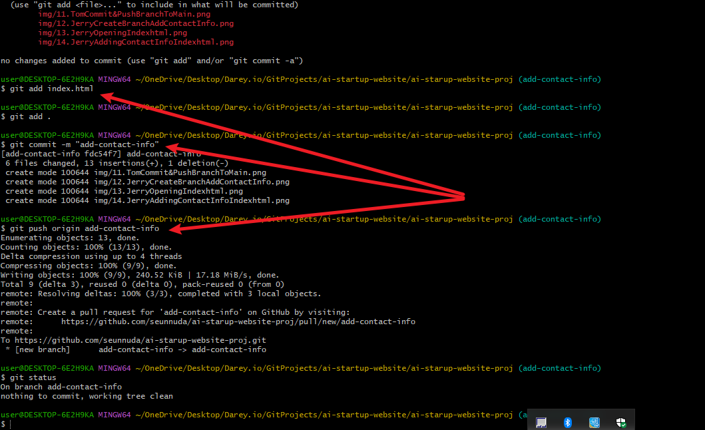
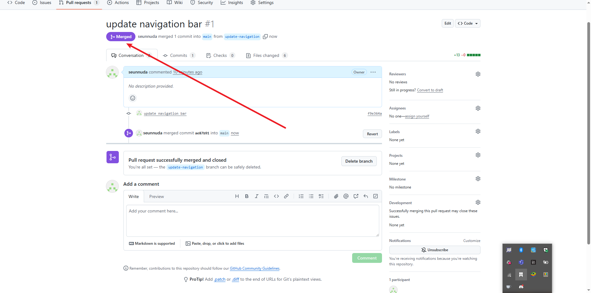

# ai-starup-website-proj

# In this mini project, we'll create a step by step project to stimulate the workflow of Tom and Jerry using GitHub. This hands-on project will include installation of Git, setting up a GitHub repository , cloning the repository, creating branches, making changes, and merging those changes back inti the main branch.

Git Installation Confrimation Page

Creation of Remote Repository

Copying Remote Repository for Clone

Cloning Repository on Local Machine

Creating Empty File "Index.html"

Updating Index.html File

Invitation to Tom and Jerry for Collaboration

Tom Accept and Copy Repository from GitHub

Tom Cloning Repository on Local Machine

Tom Create Branch Update Navigation

Tom Opening Index.html File for Update

Tom Adding Navigation To Index.html File

Tom Staging Work Done on Branch For Commit

Tom Commit And Push His Branch To Main Branch For Review

Jerry Accepting Invitation

Jerry Copied From GitHub

Jerry Cloned Repository On Local Machine

Jerry Create Branch Add Contact Info

Jerry Open Index.html And Add Contact Info To Index File

Jerry Stage Commit And Push Branch Add Contact Info To Main

Creating Pull Request For Tom Branch Update Navigation

Merge PULL Request For Tom Work

Tom Branch Successflly Merged

Compare Pull Request Jerry Branch Add Contact Info

Merge Jerry Branch Add Contact Info

Pull Request Successfully Merged
